# LFN Hauling Management System — Technical Documentation

> **Document Version:** 1.0 | **Last Updated:** March 2026
> **Stack:** ASP.NET Core 8.0 · Entity Framework Core · PostgreSQL · Bootstrap 5
> **Deployment:** GCP Cloud Run (asia-southeast1)

---

## Table of Contents

1. [System Overview](#1-system-overview)
2. [Entity Relationship Diagram (ERD)](#2-entity-relationship-diagram-erd)
3. [Operational Flowchart — Cross-Module Data Flow](#3-operational-flowchart--cross-module-data-flow)
4. [Module Workflows](#4-module-workflows)
   - [4.1 Fleet Management](#41-fleet-management)
   - [4.2 Fuel Management](#42-fuel-management)
   - [4.3 R&M (Repair & Maintenance)](#43-rm-repair--maintenance)
   - [4.4 Inventory Management](#44-inventory-management)
   - [4.5 Purchase Request (PR)](#45-purchase-request-pr)
   - [4.6 Purchase Order (PO)](#46-purchase-order-po)
   - [4.7 Good Receipt (GR)](#47-good-receipt-gr)
   - [4.8 Good Issue (GI)](#48-good-issue-gi)
   - [4.9 Accounting / Finance](#49-accounting--finance)
5. [API Endpoints Reference](#5-api-endpoints-reference)
6. [Database Schema Summary](#6-database-schema-summary)

---

## 1. System Overview

LFN Hauling Management System adalah aplikasi web berbasis minimal API yang mengelola seluruh operasional fleet hauling dari hulu ke hilir — mulai dari data kendaraan, konsumsi BBM, perawatan, procurement, hingga pencatatan akuntansi.

### Arsitektur Aplikasi

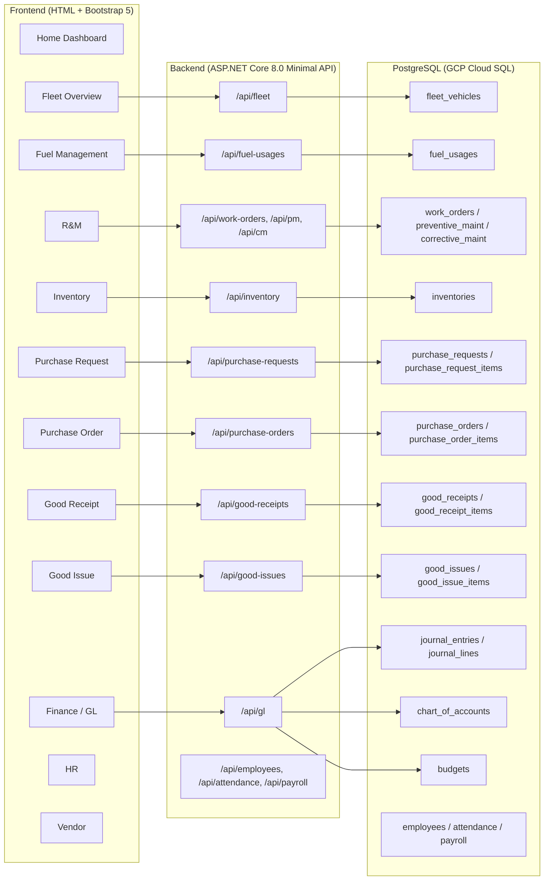

---

## 2. Entity Relationship Diagram (ERD)

```mermaid
erDiagram
    FLEET_VEHICLES {
        int Id PK
        string UnitNo UK
        string UnitDescription
        string Site
        string MerkType
        string Category
        string Status
        string VehicleType
        string FuelType
        decimal PayloadCapacity
        decimal FuelTankCapacity
        decimal AvgFuelConsumption
        string CostCenter
        string RouteCode
        decimal HMAwal
        decimal KMakhir
        decimal TotalJam
        decimal TotalKM
        decimal TotalFuel
    }

    FUEL_USAGES {
        int Id PK
        int No
        date Tanggal
        string Site
        string UnitNo FK
        string Operator
        decimal HM
        decimal KM
        decimal Pemakaian
        decimal JamKerja
        decimal EFisiensi
    }

    PURCHASE_REQUESTS {
        int Id PK
        string PRNumber UK
        date PRDate
        string Site
        string Department
        string RequestedBy
        string ApprovedBy
        string Status
    }

    PURCHASE_REQUEST_ITEMS {
        int Id PK
        int PurchaseRequestId FK
        string PartNumber
        string Description
        string Unit
        decimal Quantity
        decimal EstimatedPrice
        decimal TotalPrice
        string Priority
    }

    PURCHASE_ORDERS {
        int Id PK
        string PONumber UK
        date PODate
        string Site
        string Vendor
        string VendorCode
        string PRNumber
        string Status
        date DeliveryDate
        decimal SubTotal
        decimal Tax
        decimal Discount
        decimal TotalAmount
    }

    PURCHASE_ORDER_ITEMS {
        int Id PK
        int PurchaseOrderId FK
        string PartNumber
        string Description
        string Unit
        decimal Quantity
        decimal UnitPrice
        decimal TotalPrice
        decimal DeliveredQty
    }

    GOOD_RECEIPTS {
        int Id PK
        string GRNumber UK
        date GRDate
        string Site
        string Vendor
        string PONumber FK
        string Status
        string ReceivedBy
    }

    GOOD_RECEIPT_ITEMS {
        int Id PK
        int GoodReceiptId FK
        string PartNumber
        string Description
        string Unit
        decimal OrderedQty
        decimal ReceivedQty
        decimal AcceptedQty
        decimal RejectedQty
        string Location
    }

    INVENTORIES {
        int Id PK
        string PartNumber UK
        string MaterialDescription
        string Unit
        string Location
        decimal MinStock
        decimal MaxStock
        decimal Stock
        decimal StockValue
        decimal UnitPrice
        decimal LastPOPrice
    }

    GOOD_ISSUES {
        int Id PK
        string GINumber UK
        date GIDate
        string Site
        string Department
        string RequestNumber
        string Status
        string IssuedBy
        string ReceivedBy
    }

    GOOD_ISSUE_ITEMS {
        int Id PK
        int GoodIssueId FK
        string PartNumber
        string Description
        string Unit
        decimal RequestedQty
        decimal IssuedQty
        decimal StockBefore
        decimal StockAfter
    }

    WORK_ORDERS {
        int Id PK
        string WONumber UK
        date WODate
        string Site
        string UnitNo FK
        string WOType
        string Priority
        string Status
        decimal EstimatedCost
        decimal ActualCost
    }

    JOURNAL_ENTRIES {
        int Id PK
        string EntryNumber UK
        date EntryDate
        string PeriodMonth
        string PeriodYear
        string EntryType
        string SourceModule
        string SourceId
        string Status
        decimal TotalDebit
        decimal TotalCredit
    }

    JOURNAL_LINES {
        int Id PK
        int JournalEntryId FK
        string AccountCode
        string AccountName
        string DC
        decimal Amount
        string CostCenter
        string Site
    }

    CHART_OF_ACCOUNTS {
        int Id PK
        string AccountCode UK
        string AccountName
        string AccountType
        string NormalBalance
        decimal OpeningBalance
        decimal CurrentBalance
        bool IsActive
    }

    BUDGETS {
        int Id PK
        string BudgetNumber UK
        string PeriodMonth
        string PeriodYear
        string Site
        string Department
        string Division
        string AccountCode
        decimal PlannedAmount
        decimal ActualAmount
        decimal CommittedAmount
        decimal AvailableBudget
        string Status
    }

    FLEET_VEHICLES ||--o{ FUEL_USAGES : "records fuel per"
    FLEET_VEHICLES ||--o{ WORK_ORDERS : "maintenance on"
    PURCHASE_REQUESTS ||--o{ PURCHASE_REQUEST_ITEMS : "contains"
    PURCHASE_REQUESTS ||--o{ PURCHASE_ORDERS : "converts to"
    PURCHASE_ORDERS ||--o{ PURCHASE_ORDER_ITEMS : "contains"
    PURCHASE_ORDERS ||--o{ GOOD_RECEIPTS : "delivered as"
    GOOD_RECEIPTS ||--o{ GOOD_RECEIPT_ITEMS : "contains"
    GOOD_RECEIPT_ITEMS }o--|| INVENTORIES : "increases stock of"
    GOOD_ISSUES ||--o{ GOOD_ISSUE_ITEMS : "contains"
    GOOD_ISSUE_ITEMS }o--|| INVENTORIES : "decreases stock of"
    JOURNAL_ENTRIES ||--o{ JOURNAL_LINES : "consists of"
    JOURNAL_LINES }o--|| CHART_OF_ACCOUNTS : "posts to"
    PURCHASE_ORDER_ITEMS }o--|| INVENTORIES : "stock updates"
    WORK_ORDERS ||--o| JOURNAL_ENTRIES : "generates GL via"
    GOOD_RECEIPTS ||--o| JOURNAL_ENTRIES : "generates GL via"
    GOOD_ISSUES ||--o| JOURNAL_ENTRIES : "generates GL via"
    BUDGETS }o--|| CHART_OF_ACCOUNTS : "allocates for"
```

---

## 3. Operational Flowchart — Cross-Module Data Flow

```mermaid
flowchart TD
    %% Start
    START([Start: Planning])

    %% Fleet Core
    START --> FLEET[/"Fleet Vehicles"\n"Master data kendaraan"]
    FLEET --> FUEL[/"Fuel Usage"\n"Upload/pencatatan BBM"]
    FLEET --> RM[/"R&M"\n"Work Order & Maintenance"]

    %% Procurement Cycle
    FLEET --> INV_STOCK[/"Inventory"\n"Stock Material / Sparepart"]
    INV_STOCK --> PR[/"Purchase Request"\n"Kebutuhan Material"]
    PR --> APPROVE_PR{{"Approved?"}}
    APPROVE_PR -- No --> REVISE_PR[/"Revisi PR"/]
    REVISE_PR --> PR
    APPROVE_PR -- Yes --> PO[/"Purchase Order"\n"Kontrak dengan Vendor"]
    PO --> APPROVE_PO{{"Approved?"}}
    APPROVE_PO -- No --> REVISE_PO[/"Revisi PO"/]
    REVISE_PO --> PO
    APPROVE_PO -- Yes --> GR[/"Good Receipt"\n"Penerimaan Barang"]
    GR --> INV_UPDATE[/"Update Inventory"\n"Stock + UnitPrice"]
    INV_UPDATE --> GI[/"Good Issue"\n"Pengeluaran ke Unit"]
    GI --> FLEET_UPDATE[/"Vehicle Update"\n"R&M + HM/KM"]

    %% Financial Integration
    FUEL --> GL_FUEL[/"GL: Fuel Expense"\n"Dr. Fuel Cost / Cr. Cash"]
    GR --> GL_GR[/"GL: AP / Inventory"\n"Dr. Inventory / Cr. AP"]
    GI --> GL_GI[/"GL: Maintenance Expense"\n"Dr. Maint. Cost / Cr. Inventory"]
    RM --> GL_RM[/"GL: R&M Journal"\n"From Work Order cost"]

    %% Budget Check
    PR --> BUDGET_CHECK{{"Budget Available?"}}
    BUDGET_CHECK -- No --> BUDGET_ALERT["⚠️ Budget Alert\nNotify Manager"]
    BUDGET_CHECK -- Yes --> COMMIT_BUDGET["Commit Budget\nCommittedAmount += PO"]
    COMMIT_BUDGET --> PO

    %% GL Posting
    GL_FUEL --> GL_JOURNAL["Journal Entry\n(DRAFT)"]
    GL_GR --> GL_JOURNAL
    GL_GI --> GL_JOURNAL
    GL_RM --> GL_JOURNAL
    GL_JOURNAL --> POST_GL{{"Post Journal"}}
    POST_GL --> LEDGER[/"Ledger Update"\n"Account Balance updated"]
    POST_GL --> CPT[/"Cost per Ton"\n"Calculation"]

    %% End states
    LEDGER --> FINISH([End])
    CPT --> FINISH

    %% Styling
    classDef fleet fill:#dbeafe,stroke:#3b82f6,color:#1e40af
    classDef fuel fill:#fee2e2,stroke:#ef4444,color:#991b1b
    classDef rm fill:#ccfbf1,stroke:#0f766e,color:#115e59
    classDef inv fill:#e0e7ff,stroke:#4f46e5,color:#3730a3
    classDef pr fill:#fce7f3,stroke:#ec4899,color:#9d174d
    classDef po fill:#fef3c7,stroke:#d97706,color:#92400e
    classDef gr fill:#fecaca,stroke:#dc2626,color:#7f1d1d
    classDef gi fill:#f3e8ff,stroke:#9333ea,color:#581c87
    classDef gl fill:#e0f2fe,stroke:#0284c7,color:#075985
    classDef decision fill:#fef9c3,stroke:#ca8a04,color:#854d0e,shape:diamond
    classDef end fill:#d1fae5,stroke:#059669,color:#065f46,shape:stag

    class FLEET fleet
    class FUEL fuel
    class RM rm
    class INV_STOCK,INV_UPDATE inv
    class PR,APPROVE_PR,REVISE_PR,BUDGET_CHECK,BUDGET_ALERT,COMMIT_BUDGET pr
    class PO,APPROVE_PO,REVISE_PO po
    class GR gr
    class GI gi
    class GL_FUEL,GL_GR,GL_GI,GL_RM,GL_JOURNAL,POST_GL,LEDGER,CPT gl
    class FINISH end
```

---

## 4. Module Workflows

### 4.1 Fleet Management

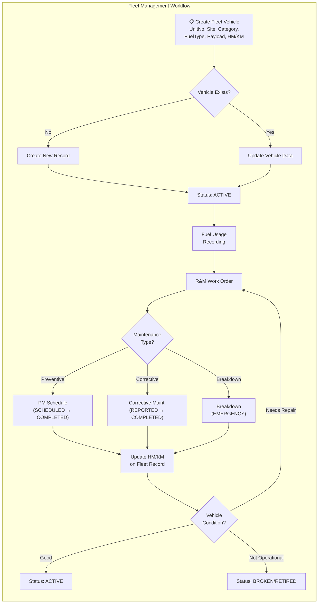

**Key Fields:**
| Field | Description |
|---|---|
| `UnitNo` | Unit identifier (unique) |
| `Site` | Lokasi: Tanjung, Sungai Dua, Sebamban, dll |
| `PayloadCapacity` | Kapasitas muatan (ton) = GrossWeight - TareWeight |
| `HM/KM` | Hour Meter / Kilometer aktual |
| `FuelRatio` | Rasio konsumsi BBM (liter/jam atau liter/km) |
| `Status` | ACTIVE, STANDBY, MAINTENANCE, BROKEN, RETIRED |

---

### 4.2 Fuel Management

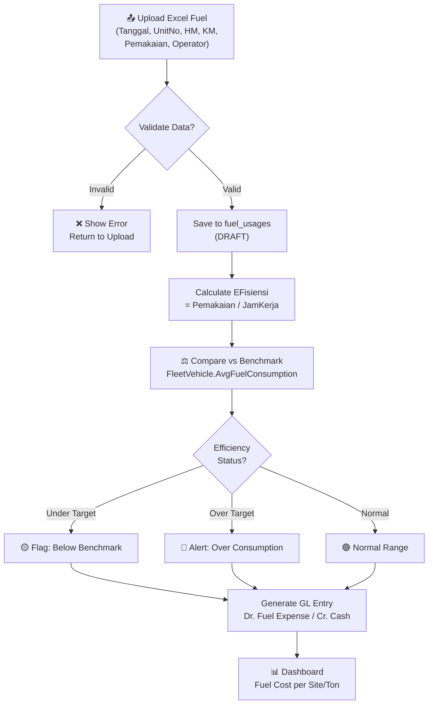

**API Endpoints:**

| Method | Endpoint | Description |
|---|---|---|
| GET | `/api/fuel-usages?site=xxx` | List fuel records |
| POST | `/api/fuel-usages/upload` | Upload from Excel |
| POST | `/api/fuel-usages` | Add single record |
| DELETE | `/api/fuel-usages/{id}` | Delete record |

---

### 4.3 R&M (Repair & Maintenance)

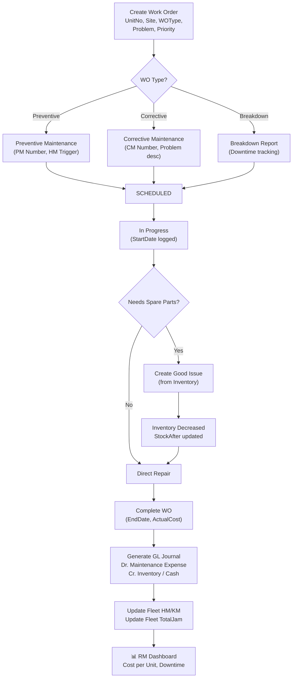

**R&M Types:**

| Type | Trigger | Key Metric |
|---|---|---|
| **PM (Preventive)** | Schedule / HM threshold | HM Value, NextHM Value |
| **Corrective** | Driver report / Inspection | RepairCost, PartsCost, LaborCost |
| **Breakdown** | Emergency | DowntimeHours, BreakdownStart/End |

---

### 4.4 Inventory Management

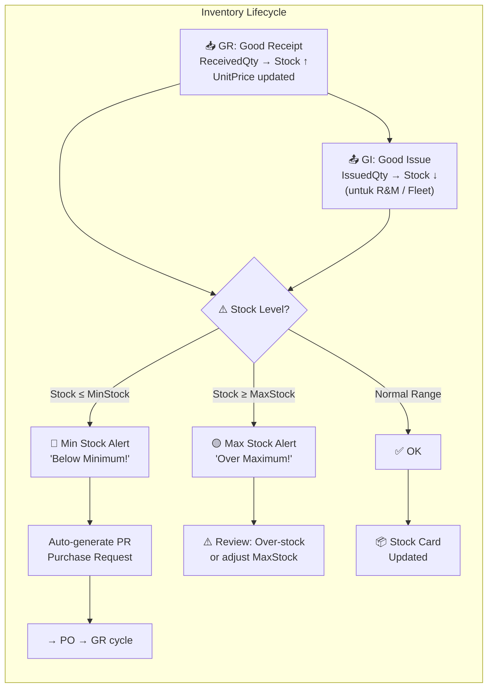

**Stock Card Logic:**
```
On GR Accepted:   Stock += AcceptedQty
                  StockValue = Stock × LastPOPrice
                  UnitPrice = LastPOPrice

On GI Issued:     Stock -= IssuedQty
                  StockValue = Stock × UnitPrice
```

---

### 4.5 Purchase Request (PR)

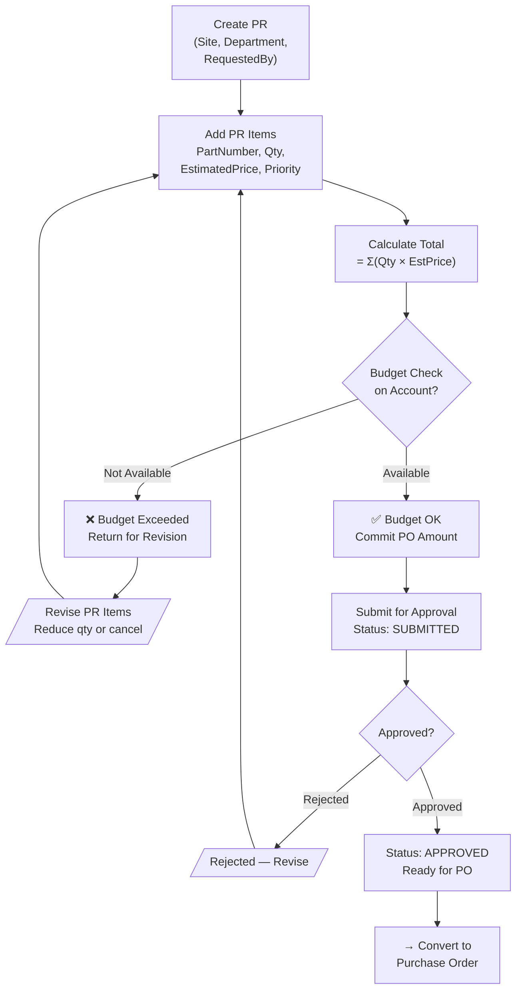

**Priority Levels:** `URGENT` → `HIGH` → `NORMAL` → `LOW`

---

### 4.6 Purchase Order (PO)

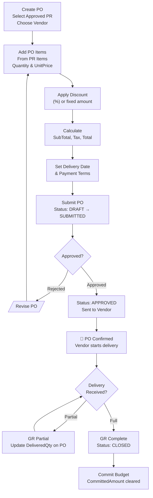

---

### 4.7 Good Receipt (GR)

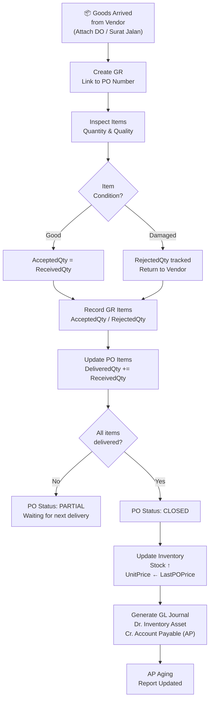

---

### 4.8 Good Issue (GI)

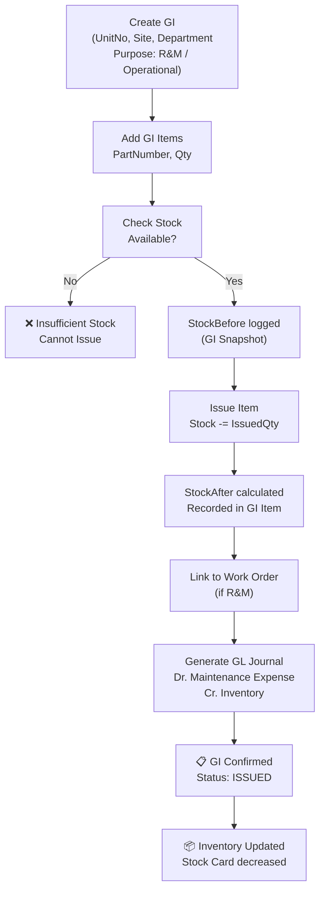

---

### 4.9 Accounting / Finance

```mermaid
flowermaid
flowchart TD
    GL1["Journal Entry Created\n(Manual or Auto from module)"] --> GL2["Add Journal Lines\nAccount + Debit/Credit\nMust balance: ΣDr = ΣCr"]
    GL2 --> GL3{"Entry\nBalanced?"}
    GL3 -->|"No"| GL4["❌ Error: Total Debit\n≠ Total Credit"]
    GL4 --> GL5[/"Adjust Lines"/]
    GL5 --> GL2
    GL3 -->|"Yes"| GL6["Status: DRAFT"]
    GL6 --> GL7{"Post\nEntry?"}
    GL7 -->|"Cancel"| GL8["Status: CANCELLED"]
    GL7 -->|"Post"| GL9["Status: POSTED\nAccount Balance updated"]
    GL9 --> GL10["📊 GL Summary\nby Period, Account, Site"]

    subgraph AutoGL["Auto-Generated Journal Sources"]
        AG1["Fuel Usage → Fuel Expense Journal"]
        AG2["GR → Inventory / AP Journal"]
        AG3["GI → Maintenance Expense Journal"]
        AG4["Work Order → R&M Cost Journal"]
        AG5["Payroll → Salary Expense Journal"]
    end

    AG1 & AG2 & AG3 & AG4 & AG5 --> GL6
```

**Budget Monitoring:**

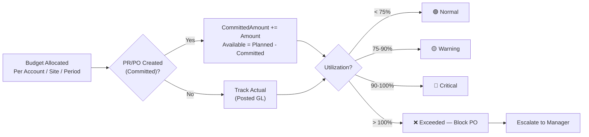

---

## 5. API Endpoints Reference

### Fleet & Fuel

| Method | Endpoint | Description |
|---|---|---|
| GET | `/api/fleet` | List all fleet vehicles |
| GET | `/api/fleet/{id}` | Get single vehicle |
| POST | `/api/fleet` | Create vehicle |
| PUT | `/api/fleet/{id}` | Update vehicle |
| GET | `/api/fuel-usages?site=xxx` | List fuel records |
| POST | `/api/fuel-usages/upload` | Bulk upload Excel |
| GET | `/api/sites` | List all sites |

### Procurement

| Method | Endpoint | Description |
|---|---|---|
| GET | `/api/purchase-requests` | List PRs |
| POST | `/api/purchase-requests` | Create PR |
| PUT | `/api/purchase-requests/{id}/approve` | Approve PR |
| GET | `/api/purchase-orders` | List POs |
| POST | `/api/purchase-orders` | Create PO |
| GET | `/api/good-receipts` | List GRs |
| POST | `/api/good-receipts` | Create GR |
| GET | `/api/good-issues` | List GIs |
| POST | `/api/good-issues` | Create GI |
| GET | `/api/inventory` | List inventory items |
| PUT | `/api/inventory/{id}` | Update item |

### Finance / GL

| Method | Endpoint | Description |
|---|---|---|
| GET | `/api/gl` | List journal entries |
| POST | `/api/gl` | Create journal entry |
| PUT | `/api/gl/{id}/post` | Post journal |
| GET | `/api/chart-of-accounts` | List COA |
| GET | `/api/budgets` | List budgets |
| POST | `/api/budgets` | Create budget |
| GET | `/api/production-data` | Production cost data |

### HR

| Method | Endpoint | Description |
|---|---|---|
| GET | `/api/employees` | List employees |
| GET | `/api/attendance` | Attendance records |
| POST | `/api/payroll/run` | Run payroll |

---

## 6. Database Schema Summary

### Core Tables

| Table | Description | Key Relationships |
|---|---|---|
| `fleet_vehicles` | Master data kendaraan | → fuel_usages, work_orders |
| `fuel_usages` | Record konsumsi BBM | ← fleet_vehicles |
| `work_orders` | Work order per unit | ← fleet_vehicles, → journal_entries |
| `preventive_maintenance` | Jadwal PM | ← fleet_vehicles |
| `corrective_maintenance` | Perbaikan korektif | ← fleet_vehicles |
| `inventories` | Stock material/sparepart | ← good_receipt_items, ← good_issue_items |
| `purchase_requests` | Header PR | → purchase_request_items |
| `purchase_request_items` | Item PR | ← purchase_requests |
| `purchase_orders` | Header PO | → purchase_order_items, ← purchase_requests, → good_receipts |
| `purchase_order_items` | Item PO | ← purchase_orders |
| `good_receipts` | Header GR | → good_receipt_items, ← purchase_orders |
| `good_receipt_items` | Item GR | ← good_receipts, → inventories |
| `good_issues` | Header GI | → good_issue_items |
| `good_issue_items` | Item GI | ← good_issues, → inventories |
| `journal_entries` | Header Jurnal | → journal_lines |
| `journal_lines` | Baris Jurnal | ← journal_entries, → chart_of_accounts |
| `chart_of_accounts` | Chart of Accounts | ← journal_lines |
| `budgets` |Anggaran | → chart_of_accounts |
| `employees` | Data karyawan | → attendance, → payroll |
| `vendors` | Master vendor | ← purchase_orders, ← good_receipts |

### Indexes & Constraints

- **Unique:** `UnitNo` on `fleet_vehicles`
- **Unique:** `PRNumber` on `purchase_requests`
- **Unique:** `PONumber` on `purchase_orders`
- **Unique:** `GRNumber` on `good_receipts`
- **Unique:** `GINumber` on `good_issues`
- **Unique:** `PartNumber` on `inventories`
- **Unique:** `EntryNumber` on `journal_entries`
- **Unique:** `AccountCode` on `chart_of_accounts`
- **Unique:** `BudgetNumber` on `budgets`

### Cascade Delete

- `journal_lines` → `journal_entries` (CASCADE)
- `purchase_request_items` → `purchase_requests` (CASCADE)
- `purchase_order_items` → `purchase_orders` (CASCADE)
- `good_receipt_items` → `good_receipts` (CASCADE)
- `good_issue_items` → `good_issues` (CASCADE)

---

## Appendix: Data Flow Summary

```
┌─────────────────────────────────────────────────────────────────┐
│                    PROCUREMENT CYCLE                            │
│                                                                 │
│  PR (DRAFT) → PR (APPROVED) → PO (DRAFT) → PO (APPROVED)      │
│       │               │              │              │          │
│       │               │              │              ▼          │
│       │               │              │      ┌─────────────┐    │
│       │               │              │      │  GOOD       │    │
│       │               │              │      │  RECEIPT    │    │
│       │               │              │      └──────┬──────┘    │
│       │               │              │             │           │
│       │               │              │      Inventory ↑       │
│       │               │              │             │           │
│       │               │              │      ┌──────┴──────┐    │
│       │               │              │      │  GOOD       │    │
│       │               │              │      │  ISSUE      │    │
│       │               │              │      └──────┬──────┘    │
│       │               │              │             │           │
│       └───────────────┴──────────────┴─────────────┘           │
│                          │                                     │
│                          ▼                                     │
│                   Journal Entries → GL → Ledger                │
│                                                        Budget  │
└─────────────────────────────────────────────────────────────────┘

┌─────────────────────────────────────────────────────────────────┐
│                   OPERATIONAL CYCLE                             │
│                                                                 │
│  Fleet Vehicle ←─────── Fuel Usage (HM/KM reading)             │
│       │                                                       │
│       ├────── Preventive Maintenance (schedule by HM)          │
│       ├────── Corrective Maintenance (on-demand repair)        │
│       └────── Breakdown (emergency)                            │
│                           │                                    │
│                           ▼                                    │
│              Good Issue (spare parts from inventory)            │
│                           │                                    │
│                           ▼                                    │
│                 Journal Entry → GL                             │
│                                                        Budget  │
└─────────────────────────────────────────────────────────────────┘
```
